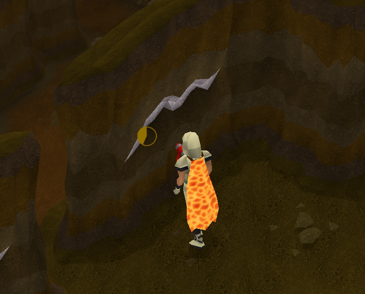

# MLM Despawn Timer

Demo of the plugin UI.

This plugin estimates the amount of time remaining for a vein in the Motherlode Mine before it depletes. This takes into account the new MLM changes as of 2025. Because its not possible to exactly estimate a vein's despawn timer if it is being mined by another player, it is just an estimate. Timers may be slightly inaccurate upon first entering the mine, and will become more accurate the longer you are inside.

Credits:
* Thanks to CreativeTechGuy's [Tree Despawn Timer Plugin](https://github.com/CreativeTechGuy/tree-despawn-timer/) for serving as a resource for the logic and patterns behind estimating despawn timers.
